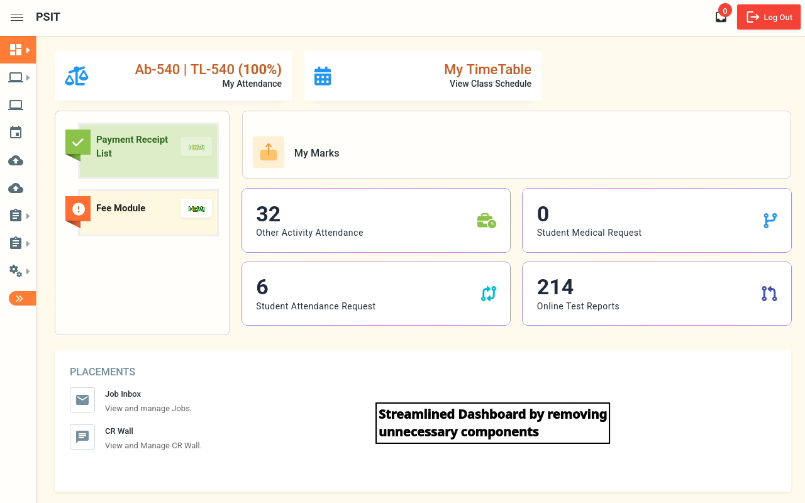
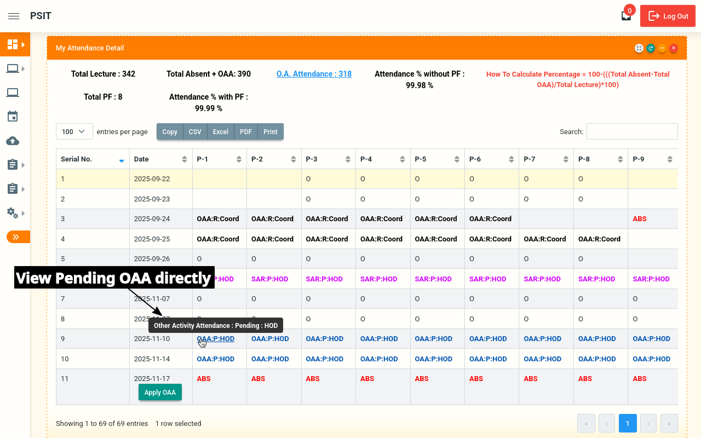
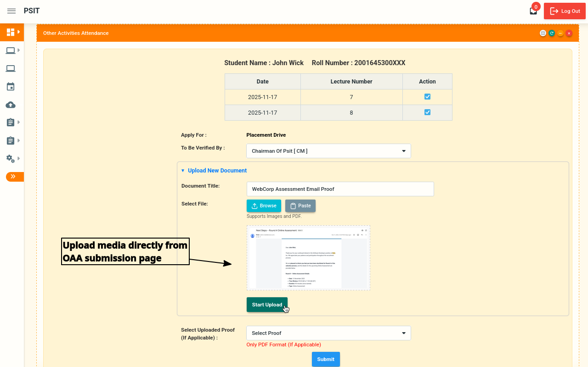
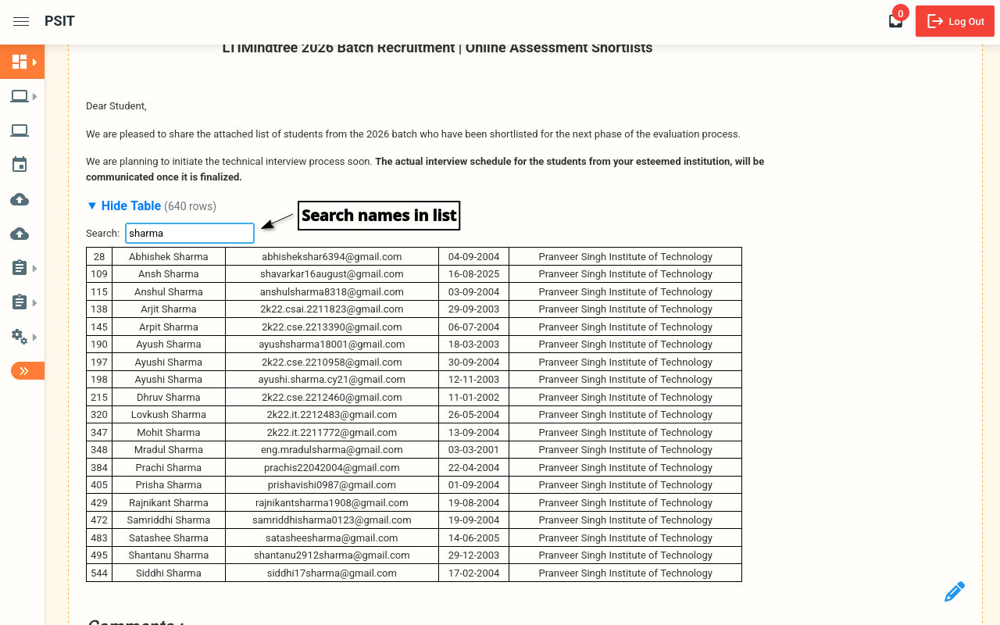

# 🎓 ErpSense

> **Supercharge your PSIT ERP experience with intelligent enhancements**

ErpSense is an ongoing open-source project designed to transform the PSIT ERP interface into a more intuitive, efficient, and user-friendly platform. Say goodbye to cluttered dashboards and tedious navigation. ErpSense brings smart features directly to where you need them.

## 📥 Download Now

<div align="center">

<a href="https://chromewebstore.google.com/detail/erpsense/cemfoagomhonpemjnjehciigjieojfao">
  
</a>

<a href="https://addons.mozilla.org/en-US/android/addon/erpsense">
  
</a>

</div>

---

## ✨ Features

### **Attendance Insights**
View your pending OAA (Other Activity Attendance) and SAR (Student Attendance Request) requests directly from your attendance page. No more navigating through multiple menus!

### **Smart Tables**
Expand and collapse CR wall tables with integrated search functionality for cleaner, more intuitive layouts. Find what you need, fast.

### **Optimized Dashboard**
Enjoy a clean, minimalist interface with unnecessary features removed and a minimized sidebar by default. Focus on what matters.

### **Quick Actions**
- **Apply OAA Directly**: Submit OAA requests right from your attendance page
- **Auto-fill Forms**: Automatically populate OAA request forms based on your last submission
- **Media Upload**: Upload media files directly from the OAA submission page
- **Quick Toggle**: Enable/disable the extension with a single click from the popup menu
- **Smart Navigation**: Click any pending request to jump straight to its detail page

---

## 📸 Screenshots

<div align="center">

<table>
<tr>
<td width="50%">

### Attendance Page with Pending Requests


*View pending OAA and SAR requests directly from your attendance page with helpful tooltips*

</td>
<td width="50%">

### OAA Direct Upload & Auto-fill


*Upload media directly and auto-fill forms from your last request*

</td>
</tr>
<tr>
<td width="50%">

### Smart Tables with Search


*Collapsible tables with search functionality make the CR wall infinitely more manageable*

</td>
<td width="50%">

### Quick Toggle Popup


*Enable or disable features with a single click*

</td>
</tr>
</table>

</div>

---

## 🏗️ Project Structure

```
ErpSense/
├── content/                   # Content scripts
├── icons/                     # Icons and screenshots for README
├── lib/                       # Helper scripts
├── offscreen/                 # Chrome specific DOM-parsing scripts
├── popup/                     # Extension popup interface
├── styles/                    # CSS stylesheets
├── manifest.chrome.json       # Chrome extension manifest
├── manifest.firefox.json      # Firefox extension manifest
├── background-chrome.json     # Background script for chrome
├── background-firefox.json    # Background script for firefox
└── switch                     # For debugging, each switch manifests
```

---

## 📜 License

This project is licensed under the MIT License - see the [LICENSE](LICENSE) file for details.

---

## 📞 Support & Feedback

- 🐛 **Found a bug?** [Open an issue](https://github.com/AshishJii/ErpSense/issues)
- 💡 **Have a suggestion?** [Start a discussion](https://github.com/AshishJii/ErpSense/discussions)
- ⭐ **Like ErpSense?** Rate us on chrome web store
- 📧 **Contact:** [ashishverma208004@gmail.com]

---

<div align="center">

**Made with 💙 for PSIT Students**

[](https://github.com/AshishJii/ErpSense)
[](https://github.com/AshishJii)

</div>
